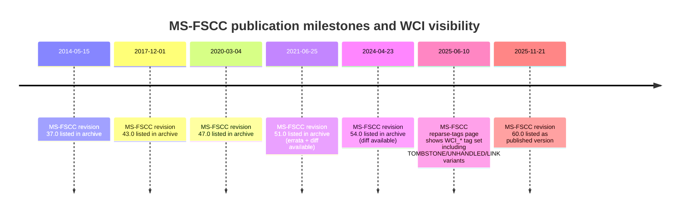

# Parsing WCI Data Buffer Structures in MS-FSCC

## Executive summary

Windows Container Isolation (WCI) is surfaced in MS-FSCC primarily as a family of **reparse point tags**—including `IO_REPARSE_TAG_WCI` (`0x80000018`), `IO_REPARSE_TAG_WCI_1` (`0x90001018`), `IO_REPARSE_TAG_WCI_LINK` (`0xA0000027`), `IO_REPARSE_TAG_WCI_LINK_1` (`0xA0001027`), `IO_REPARSE_TAG_WCI_TOMBSTONE` (`0xA000001F`), and `IO_REPARSE_TAG_UNHANDLED` (`0x80000020`). In the same MS-FSCC section, Microsoft characterizes most non-symlink reparse tags (including the WCI family) as **server-side interpretation only**, advising that clients treat the associated data as opaque. citeturn23view3

MS-FSCC does define the **generic** `REPARSE_DATA_BUFFER` header (tag + length + reserved + variable payload), but **does not publish a normative WCI payload layout**. citeturn17view0turn23view3 As a result, any “WCI buffer parsing” beyond header-level extraction is necessarily based on **reverse engineering, forensic documentation, and de-facto structures** found in SDK-adjacent projects and security research. citeturn25view2turn34view0turn21view3turn21view1

Across multiple independent sources (forensics documentation, security research, and tooling), the WCI payload used by `IO_REPARSE_TAG_WCI` / `_WCI_1` / `_WCI_LINK_1` converges on a consistent, compact format:

- `Version` (4 bytes)
- `Reserved` (4 bytes)
- `LookupGuid` (16 bytes, Windows GUID wire representation)
- `PathStringLength` (2 bytes, **bytes**)
- `PathString` (UTF‑16LE, **not NUL-terminated**, length given above)

This is demonstrated by a real on-disk test vector for `_WCI_1` from entity["organization","Check Point Research","security research team"] and reinforced by a matching C struct layout published by entity["company","Deep Instinct","cybersecurity vendor"] and by the forensic NTFS reference in entity["organization","libyal","open source forensics org"]’s `libfsntfs` documentation. citeturn25view2turn34view0turn21view3

## What MS-FSCC explicitly defines about WCI

MS-FSCC’s “Reparse Tags” list is the authoritative place where WCI appears by name in the spec: it enumerates WCI-related tag constants and their meanings (WCI, WCI_1, WCI_TOMBSTONE, UNHANDLED, WCI_LINK, WCI_LINK_1). citeturn23view3 The same section also states that, except for `IO_REPARSE_TAG_SYMLINK`, the listed tags are processed server-side and “clients SHOULD treat associated reparse data as opaque data,” which explains why WCI’s payload is not standardized in MS-FSCC. citeturn23view3

MS-FSCC defines the generic buffer container used to carry reparse data:

- `ReparseTag` (4 bytes)
- `ReparseDataLength` (2 bytes)
- `Reserved` (2 bytes)
- `DataBuffer` (variable bytes; owner-defined)

This is MS-FSCC §2.1.2.2 `REPARSE_DATA_BUFFER`, which describes the payload as “reparse-specific data” defined by the implementing filter driver. citeturn17view0

MS-FSCC also defines protocol-level message framing, such as the FSCTL response for retrieving reparse points (“FSCTL_GET_REPARSE_POINT Reply”), which returns either `REPARSE_DATA_BUFFER` or `REPARSE_GUID_DATA_BUFFER` (and uses `ReparseTag` to determine which interpretation applies). citeturn22view2

Finally, MS-FSCC provides a standard way to **query just the reparse tag (without parsing the full buffer)**: `FileAttributeTagInformation` returns `FileAttributes` plus a `ReparseTag` field, and explicitly points back to the reparse-tag list for semantics. citeturn35view0turn23view3

## WCI buffer layouts observed in Windows and community parsers

### Canonical container layout: REPARSE_DATA_BUFFER header

On Windows, `REPARSE_DATA_BUFFER` is documented in the WDK as a C struct with `ReparseTag`, `ReparseDataLength`, and `Reserved`, followed by a union whose “generic” member is a raw byte array. citeturn22view0

A subtle but important point for parsers: the WDK documentation states `Reserved` is **only meaningful during create operations failing with `STATUS_REPARSE`**, where it contains the “unparsed portion” name length; otherwise it should be treated as reserved. citeturn22view0turn34view0

### De-facto WCI payload layout

Multiple sources converge on the following WCI payload structure (the bytes that begin at `DataBuffer`, i.e., immediately after the 8-byte header):

| Relative offset (inside DataBuffer) | Absolute offset (from start of REPARSE_DATA_BUFFER) | Size | Type | Field name (common) | Notes |
|---:|---:|---:|---|---|---|
| 0x00 | 0x08 | 4 | `uint32` | `Version` | Commonly observed as `1`. citeturn25view2turn21view3turn34view0 |
| 0x04 | 0x0C | 4 | `uint32` | `Reserved` | Typically `0`. citeturn25view2turn21view3turn34view0 |
| 0x08 | 0x10 | 16 | `GUID` | `LookupGuid` / `Guid` | GUID wire/packet representation is the Windows form (Data1/Data2/Data3 little-endian). citeturn18search5turn25view2turn34view0 |
| 0x18 | 0x20 | 2 | `uint16` | `PathStringLength` / `WciNameLength` | **Byte length**, not UTF‑16 code points. citeturn25view2turn21view3turn21view1turn34view0 |
| 0x1A | 0x22 | variable | bytes | `PathString` / `WciName` | UTF‑16LE; generally **not NUL-terminated**. citeturn25view2turn21view3turn21view1turn34view0 |

This same layout is described both as **WCI reparse data** in `libfsntfs` forensic documentation and as the internal buffer for `_WCI_1`/`_WCI_LINK_1` in Deep Instinct’s analysis. citeturn21view3turn34view0

A minimal header excerpt (field list only) appears in the FileTest project’s Windows SDK aggregation header for `IO_REPARSE_TAG_WCI` (names may differ but positions align): `Version`, `Reserved`, `LookupGuid`, `WciNameLength`, `WciName`. citeturn21view1

### WCI variants and what is (not) known

MS-FSCC documents the **existence** of multiple WCI-family tags but does not define per-tag buffer formats. citeturn23view3 Based on public research and tooling:

- `IO_REPARSE_TAG_WCI_1` (`0x90001018`) is confirmed to use the layout above in a real NTFS $REPARSE_POINT attribute dump. citeturn25view2
- Deep Instinct states that **both** `IO_REPARSE_TAG_WCI_1` and `IO_REPARSE_TAG_WCI_LINK_1` use the same “WcifsReparseDataBuffer” layout shown above (with the GUID sometimes described as “hardcoded value”). citeturn34view0
- `IO_REPARSE_TAG_WCI_LINK` (`0xA0000027`) is highlighted as a distinct WCI-family tag and has been used as a parsing/memory-corruption attack surface in published conference material; however, that material treats its payload as arbitrary bytes (in order to trigger vulnerabilities) rather than documenting a normal semantic layout. citeturn32view0turn32view1turn32view2turn31view0
- `IO_REPARSE_TAG_WCI_TOMBSTONE` and `IO_REPARSE_TAG_UNHANDLED` are listed in MS-FSCC, but no public canonical payload format is described there. citeturn23view3turn36search0

One practical pitfall: some third-party headers contain incorrect constants for certain tags. For example, one popular reparse header collection defines `IO_REPARSE_TAG_UNHANDLED` as `0xA0000020`, while MS-FSCC defines `IO_REPARSE_TAG_UNHANDLED` as `0x80000020`. Parsers should prefer MS-FSCC / Win32 docs for tag values. citeturn36search2turn36search0turn23view3

## Test vectors and field-by-field decoding

### Real-world WCI_1 buffer (on-disk NTFS $REPARSE_POINT)

The following hex bytes (shown in a public NTFS parsing walkthrough) are a complete `REPARSE_DATA_BUFFER` for tag `0x90001018` (`IO_REPARSE_TAG_WCI_1`), followed by the WCI payload. citeturn25view2

```text
18 10 00 90  54 00 00 00
01 00 00 00  00 00 00 00
77 F6 64 82  B0 40 A5 4C  BF 9A 94 4A  C2 DA 80 87
3A 00
57 00 69 00 6E 00 64 00 6F 00 77 00 73 00 5C 00
53 00 79 00 73 00 74 00 65 00 6D 00 33 00 32 00
5C 00 6B 00 65 00 72 00 6E 00 65 00 6C 00 33 00
32 00 2E 00 64 00 6C 00 6C 00
```

Field mapping (all integers little-endian):

- `ReparseTag` = bytes `18 10 00 90` → `0x90001018` (`IO_REPARSE_TAG_WCI_1`). citeturn25view2turn23view3
- `ReparseDataLength` = `54 00` → `0x0054` (= 84 bytes). citeturn25view2
- `Reserved`/`UnparsedNameLength` = `00 00` (0 here). citeturn25view2turn22view0
- WCI payload (`DataBuffer`, 84 bytes):
  - `Version` = `01 00 00 00` → 1. citeturn25view2turn34view0turn21view3
  - `Reserved` = `00 00 00 00` → 0. citeturn25view2turn34view0turn21view3
  - `LookupGuid` raw bytes =
    `77 F6 64 82 B0 40 A5 4C BF 9A 94 4A C2 DA 80 87`
    Interpreted as GUID = `8264f677-40b0-4ca5-bf9a-944ac2da8087` (Windows GUID byte order rules apply). citeturn25view2turn18search5turn34view0
  - `PathStringLength` = `3A 00` → 58 bytes. citeturn25view2turn34view0turn21view3
  - `PathString` = 58 bytes UTF‑16LE → `Windows\System32\kernel32.dll` (no terminator). citeturn25view2turn21view3

A strong consistency check is that `ReparseDataLength` equals `4 + 4 + 16 + 2 + 58 = 84`, so the buffer is internally self-describing and length-safe when parsed with bounds checks. citeturn25view2turn17view0

### Safety note from published exploitation work

Conference material on reparse-point attack surfaces shows that WCI-family tags (notably `IO_REPARSE_TAG_WCI_LINK`) have been used in real vulnerability research; examples include crafted `ReparseDataLength` values and payloads designed to trigger unsafe copies. This is a strong justification for implementing strict length validation and defensive parsing. citeturn32view1turn32view2turn31view0

## Parsing guidance and reference implementations

### Practical parsing rules

The guidance below is intended for **forensic/offline parsing** (NTFS $REPARSE_POINT attribute extraction) and **API-level parsing** (buffers returned by `FSCTL_GET_REPARSE_POINT`) where you already have a raw `REPARSE_DATA_BUFFER`. citeturn22view1turn25view1turn22view0turn17view0

Validation and decoding rules that hold up well across variants:

- Treat the first 8 bytes as the `REPARSE_DATA_BUFFER` fixed header: `tag:uint32`, `len:uint16`, `reserved:uint16`. citeturn17view0turn22view0
- Require `total_buffer_len >= 8` and `total_buffer_len >= 8 + ReparseDataLength`. (`FSCTL_GET_REPARSE_POINT` explicitly defines buffer sizing constraints and can return overflow/too-small statuses.) citeturn22view1turn22view0
- For WCI-family tags (`WCI`, `WCI_1`, `WCI_LINK`, `WCI_LINK_1`), attempt to parse the inner WCI payload **only if** `ReparseDataLength >= 26` (minimum for `Version+Reserved+GUID+PathLen`). citeturn34view0turn21view3turn21view1turn25view2
- Parse integers as little-endian; decode GUID using Windows GUID wire rules (Data1/Data2/Data3 LE; Data4 as bytes), and decode the path as UTF‑16LE. citeturn25view2turn18search5turn21view3turn34view0turn27view0
- Validate `PathStringLength`:
  - Must be `<= ReparseDataLength - 26`
  - Should be even (`PathStringLength % 2 == 0`) because UTF‑16LE
  - If `PathStringLength == 0`, treat as empty path
  - If the decoded string ends with `\u0000`, treat it as an optional terminator and strip it (heuristic—some implementations may include it despite “counted string” conventions). citeturn21view3turn21view1turn34view0
- Preserve unknowns:
  - Keep `Reserved` (outer header) as raw; it may be meaningful only in specific I/O paths (create + STATUS_REPARSE). citeturn22view0turn34view0
  - Keep inner `Reserved` (WCI payload) as raw and include it in outputs for diffing across systems. citeturn21view3turn34view0
- For `WCI_TOMBSTONE` and `UNHANDLED`, default to “opaque payload” unless you have empirical evidence they follow the same WCI payload format on your target corpus. MS-FSCC provides no defined structure for them. citeturn23view3turn36search0turn17view0

### Pseudocode

```text
function parse_reparse_data_buffer(buf):
    require len(buf) >= 8
    tag  = le_u32(buf[0:4])
    rlen = le_u16(buf[4:6])
    rsvd = le_u16(buf[6:8])

    require len(buf) >= 8 + rlen
    payload = buf[8 : 8 + rlen]

    result = { tag, rlen, reserved: rsvd, payload_raw: payload }

    if tag in {WCI, WCI_1, WCI_LINK, WCI_LINK_1} and rlen >= 26:
        ver = le_u32(payload[0:4])
        inner_rsvd = le_u32(payload[4:8])
        guid_bytes = payload[8:24]
        path_len = le_u16(payload[24:26])

        if path_len <= rlen - 26 and path_len % 2 == 0:
            path_bytes = payload[26 : 26 + path_len]
            path = utf16le_decode(path_bytes)
            if path endswith "\u0000": path = path[:-1]
            result.wci = { version: ver, reserved: inner_rsvd, guid: guid_bytes, path_len, path }
            result.payload_interpretation = "wci_like"
        else:
            result.payload_interpretation = "wci_like_invalid_lengths"

    return result
```

### Example code snippet in C (parsing only)

```c
#include <stdint.h>
#include <stdbool.h>
#include <stddef.h>

static uint16_t le16(const uint8_t *p) { return (uint16_t)p[0] | ((uint16_t)p[1] << 8); }
static uint32_t le32(const uint8_t *p) { return (uint32_t)p[0] | ((uint32_t)p[1] << 8) | ((uint32_t)p[2] << 16) | ((uint32_t)p[3] << 24); }

typedef struct {
    uint32_t tag;
    uint16_t data_len;
    uint16_t reserved;
    const uint8_t *data;   // points into the input buffer
} reparse_hdr_t;

bool parse_reparse_hdr(const uint8_t *buf, size_t buf_len, reparse_hdr_t *out) {
    if (!buf || !out || buf_len < 8) return false;
    out->tag      = le32(buf + 0);
    out->data_len = le16(buf + 4);
    out->reserved = le16(buf + 6);
    if (buf_len < 8u + (size_t)out->data_len) return false;
    out->data = buf + 8;
    return true;
}

/* WCI-like payload parsing:
   payload layout: u32 ver, u32 reserved, 16-byte GUID, u16 path_len_bytes, UTF-16LE bytes */
bool parse_wci_payload(const uint8_t *payload, size_t payload_len,
                       uint32_t *ver_out, uint32_t *res_out,
                       const uint8_t **guid16_out,
                       uint16_t *path_len_out, const uint8_t **path_bytes_out) {
    if (!payload || payload_len < 26) return false;
    uint32_t ver = le32(payload + 0);
    uint32_t res = le32(payload + 4);
    const uint8_t *guid16 = payload + 8;
    uint16_t path_len = le16(payload + 24);

    if ((path_len & 1u) != 0) return false;              // must be even for UTF-16LE
    if ((size_t)path_len > payload_len - 26u) return false;

    if (ver_out) *ver_out = ver;
    if (res_out) *res_out = res;
    if (guid16_out) *guid16_out = guid16;
    if (path_len_out) *path_len_out = path_len;
    if (path_bytes_out) *path_bytes_out = payload + 26;
    return true;
}
```

### Example code in Python (parsing + decoding)

```python
import struct
import uuid

WCI_TAGS = {
    0x80000018,  # IO_REPARSE_TAG_WCI
    0x90001018,  # IO_REPARSE_TAG_WCI_1
    0xA0000027,  # IO_REPARSE_TAG_WCI_LINK
    0xA0001027,  # IO_REPARSE_TAG_WCI_LINK_1
}

def parse_reparse_data_buffer(buf: bytes) -> dict:
    if len(buf) < 8:
        raise ValueError("Buffer too short for REPARSE_DATA_BUFFER header")

    tag, data_len, reserved = struct.unpack_from("<IHH", buf, 0)
    if len(buf) < 8 + data_len:
        raise ValueError("Buffer too short for declared ReparseDataLength")

    payload = buf[8:8 + data_len]
    out = {
        "reparse_tag": tag,
        "reparse_data_length": data_len,
        "reserved_or_unparsed_name_length": reserved,
        "payload_raw": payload,
        "wci": None,
    }

    if tag in WCI_TAGS and data_len >= 26:
        ver, inner_reserved = struct.unpack_from("<II", payload, 0)
        guid_raw = payload[8:24]
        path_len = struct.unpack_from("<H", payload, 24)[0]

        if path_len % 2 != 0 or path_len > (data_len - 26):
            out["wci"] = {"error": "invalid PathStringLength"}
            return out

        path_bytes = payload[26:26 + path_len]
        path = path_bytes.decode("utf-16le", errors="strict")
        if path.endswith("\x00"):
            path = path[:-1]  # heuristic trim of accidental terminator

        # uuid.UUID(bytes_le=...) matches Windows GUID in memory/wire layout
        guid = str(uuid.UUID(bytes_le=guid_raw))

        out["wci"] = {
            "version": ver,
            "reserved": inner_reserved,
            "lookup_guid": guid,
            "path_len_bytes": path_len,
            "path": path,
        }

    return out
```

## Related documentation and ecosystem of parsers and analyses

Microsoft’s Win32/WDK documentation provides the operational envelope and constraints around reparse points: they are user-defined data attached to files/directories and interpreted by corresponding filter drivers; the data (including tag and optional GUID) is limited to 16 KB; and reparse tag bit layouts and macros are documented in the Win32 tag reference. citeturn25view1turn25view0turn22view1turn22view0

For WCI specifically, high-signal community references include:

- entity["organization","Check Point Research","security research team"]: demonstrates real WCI reparse data in Windows Sandbox, including a full hex dump and the interpretation of “version, GUID, path string length, path.” citeturn25view2
- entity["company","Deep Instinct","cybersecurity vendor"]: publishes a WCI payload struct for `_WCI_1`/`_WCI_LINK_1`, ties behavior to `wcifs.sys`, and provides semantics (redirection vs “copy-on-open protection”). citeturn34view0
- entity["people","Tao Yan","palo alto networks researcher"] and entity["people","Bo Qu","palo alto networks researcher"] (entity["company","Palo Alto Networks","cybersecurity company"]): conference material showing WCI tags in the reparse tag space and highlighting WCI-family tags as a vulnerability/attack surface (important for defensive parsing). citeturn31view0turn32view0turn32view1turn32view2
- Open-source / community tooling that encodes the WCI field layout:
  - `FileTest`’s `WinSDK.h` includes a WCI payload field list (`Version`, `Reserved`, GUID, `WciNameLength`, `WciName`). citeturn21view1
  - `libfsntfs` documentation includes an explicit offset/size table for WCI reparse data, including UTF‑16LE and length-in-bytes semantics. citeturn21view3
  - `SysToolsLib` parses WCI by treating the WCI name length as bytes and dividing by 2 to count UTF‑16 code units (a practical confirmation of encoding). citeturn21view0turn36search9
  - `go-winio` demonstrates common Windows reparse-point parsing patterns with explicit little-endian decoding and offset discipline (even though it does not implement WCI parsing). citeturn27view0

## Versioning, spec history, and open questions

### MS-FSCC version availability and change artifacts

The MS-FSCC landing page enumerates a long set of publication dates, protocol revision numbers, and download artifacts (PDF, DOCX, plus Diff/Errata for many versions). As of this writing, the published version listed is dated **2025‑11‑21 (protocol revision 60.0)**, with a detailed archive extending back to at least 2014 and including periodic Errata and Diff documents. citeturn33view0

The MS-FSCC “Reparse Tags” page itself shows a “Last updated” timestamp (and contains the WCI-family tag list including `WCI_TOMBSTONE`, `UNHANDLED`, `WCI_LINK`, etc.), which is useful when correlating tag vocabulary changes over time. citeturn23view3turn36search0

### Timeline of observable publication milestones


citeturn33view0turn23view3

### Gaps and recommended heuristics

The central ambiguity remains: MS-FSCC intentionally treats WCI-family tag payloads as owner-defined and (for wire purposes) opaque, so there is no Microsoft-published guarantee that the WCI payload layout is stable across all tags and Windows versions. citeturn17view0turn23view3

Given that gap, the most robust strategy for real-world parsers is:

- Implement full support for the **generic** `REPARSE_DATA_BUFFER` header (always safe, standardized). citeturn17view0turn22view0
- For a known, explicitly validated subset (`WCI_1` at minimum), parse the de-facto WCI payload with strict bounds checks and emit both decoded fields and raw bytes for forensic traceability. citeturn25view2turn21view3turn34view0
- Treat other WCI-family tags as “maybe-WCI-like” and only decode if the payload passes all structural validations (length, even UTF‑16 length, etc.); otherwise keep them opaque. citeturn23view3turn36search0turn31view0turn32view1
- Preserve and report `LookupGuid` values even when their semantics are unclear; research indicates some GUIDs may act as a host/base-layer identifier in container/sandbox scenarios, but this is not standardized in MS-FSCC. citeturn25view2turn34view0
